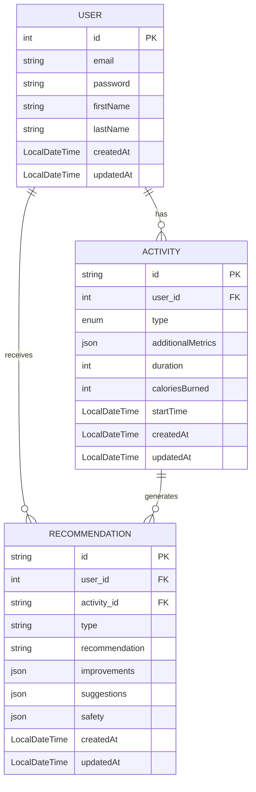

# 🏋️ Fitness Tracker API

A Spring Boot REST API for tracking workouts and receiving AI-powered fitness recommendations.

---

## 📋 Table of Contents

- [Overview](#overview)
- [Tech Stack](#tech-stack)
- [Entity Relationship Diagram](#entity-relationship-diagram)
- [Data Models](#data-models)
- [Activity Types](#activity-types)
- [Getting Started](#getting-started)

---

## Overview

The Fitness Tracker API allows users to log physical activities and receive personalized recommendations based on their workout history. It supports a wide range of activity types and stores structured recommendation data including improvements, suggestions, and safety tips.

---

## Tech Stack

- **Java 17+**
- **Spring Boot 3.x**
- **Jakarta Persistence (JPA / Hibernate)**
- **PostgreSQL** (JSON column support via `@JdbcTypeCode`)
- **Jackson** (JSON serialization)

---

## Entity Relationship Diagram



---

## Data Models

### User

| Field | Type | Description |
|-------|------|-------------|
| `id` | `int` (AUTO) | Primary key |
| `email` | `String` | User's email address |
| `password` | `String` | Hashed password |
| `firstName` | `String` | First name |
| `lastName` | `String` | Last name |
| `createdAt` | `LocalDateTime` | Record creation timestamp |
| `updatedAt` | `LocalDateTime` | Last update timestamp |

**Relationships:**
- One user → many `Activity` records (cascade all, orphan removal)
- One user → many `Recommendation` records (cascade all, orphan removal)

---

### Activity

| Field | Type | Description |
|-------|------|-------------|
| `id` | `UUID` | Primary key |
| `user_id` | `int` (FK) | Reference to `User` |
| `type` | `ActivityType` (enum) | Type of workout |
| `additionalMetrics` | `JSON` | Extra metrics (pace, heart rate, etc.) |
| `duration` | `Integer` | Duration in minutes |
| `caloriesBurned` | `Integer` | Estimated calories burned |
| `startTime` | `LocalDateTime` | When the activity started |
| `createdAt` | `LocalDateTime` | Record creation timestamp |
| `updatedAt` | `LocalDateTime` | Last update timestamp |

**Relationships:**
- Many activities → one `User`
- One activity → many `Recommendation` records

---

### Recommendation

| Field | Type | Description |
|-------|------|-------------|
| `id` | `UUID` | Primary key |
| `user_id` | `int` (FK) | Reference to `User` |
| `activity_id` | `UUID` (FK) | Reference to `Activity` |
| `type` | `String` | Category of recommendation |
| `recommendation` | `String` (2000 chars) | Main recommendation text |
| `improvements` | `JSON` (`List<String>`) | Suggested improvements |
| `suggestions` | `JSON` (`List<String>`) | General suggestions |
| `safety` | `JSON` (`List<String>`) | Safety tips |
| `createdAt` | `LocalDateTime` | Record creation timestamp |
| `updatedAt` | `LocalDateTime` | Last update timestamp |

---

## Activity Types

The `ActivityType` enum supports the following workout categories:

| Value | Description |
|-------|-------------|
| `RUNNING` | Outdoor or treadmill running |
| `WALKING` | Casual or brisk walking |
| `CYCLING` | Road or stationary cycling |
| `SWIMMING` | Pool or open water swimming |
| `WEIGHT_TRAINING` | Resistance / strength training |
| `YOGA` | Yoga sessions |
| `HIIT` | High-intensity interval training |
| `CARDIO` | General cardio workouts |
| `STRETCHING` | Flexibility and stretching |
| `OTHER` | Any other activity type |

---

## Getting Started

### Prerequisites

- Java 17+
- Maven or Gradle
- PostgreSQL (with JSON support enabled)

### Clone & Run

```bash
git clone https://github.com/your-username/fitness-tracker.git
cd fitness-tracker
./mvnw spring-boot:run
```

### Configuration

Update `application.properties` or `application.yml`:

```properties
spring.datasource.url=jdbc:postgresql://localhost:5432/fitness_db
spring.datasource.username=your_user
spring.datasource.password=your_password
spring.jpa.hibernate.ddl-auto=update
```

---

## Foreign Keys

| Constraint Name | Table | References |
|----------------|-------|------------|
| `fk_activity_user` | `activity.user_id` | `user.id` |
| `fk_recommendation_user` | `recommendation.user_id` | `user.id` |
| `fk_recommendation_activity` | `recommendation.activity_id` | `activity.id` |

---

## License

MIT License. See [LICENSE](LICENSE) for details.
